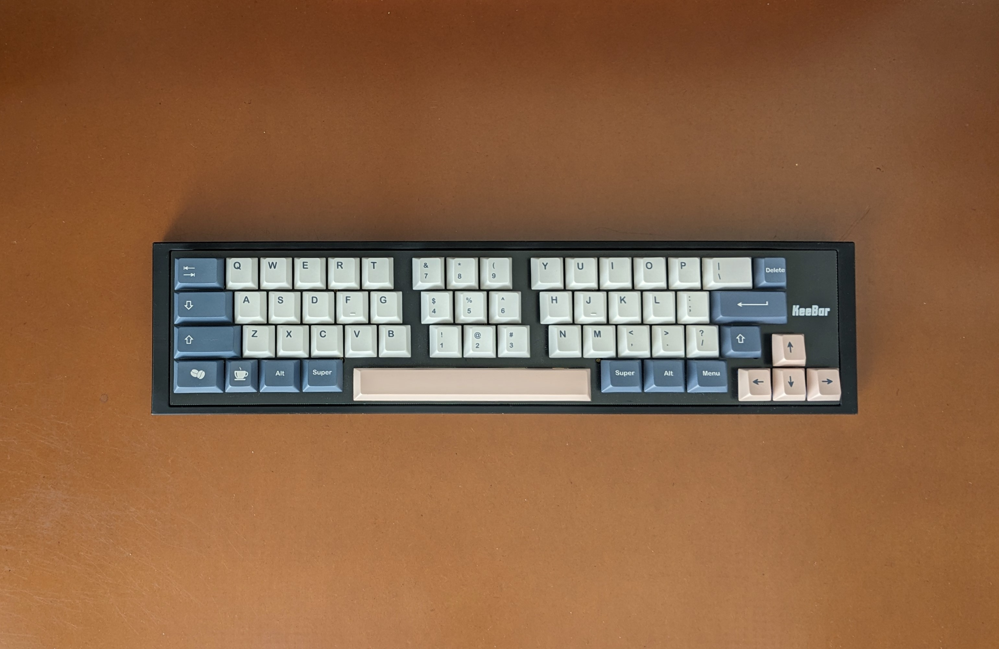
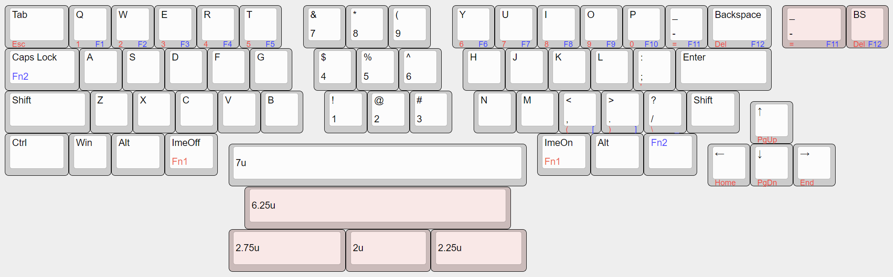

# KeeBar

A extended 40% mechanical keyboard PCB, plate and case.

## Default Layout

You can also customize the layout using [Vial](https://get.vial.today/).

OSのハードウェアキーボードレイアウト設定が日本語キーボード「（106/109キー）」に設定されている場合は、[default_layout_jp.vil](firmware/QMK/default_layout_jp.vil)ファイルをロードするといい感じになります。

## License

This project is licensed under the MIT License, see the [LICENSE file](LICENSE) for details.
