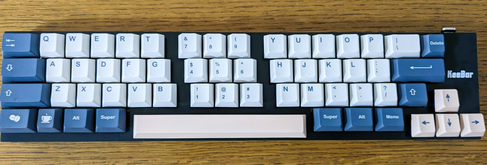
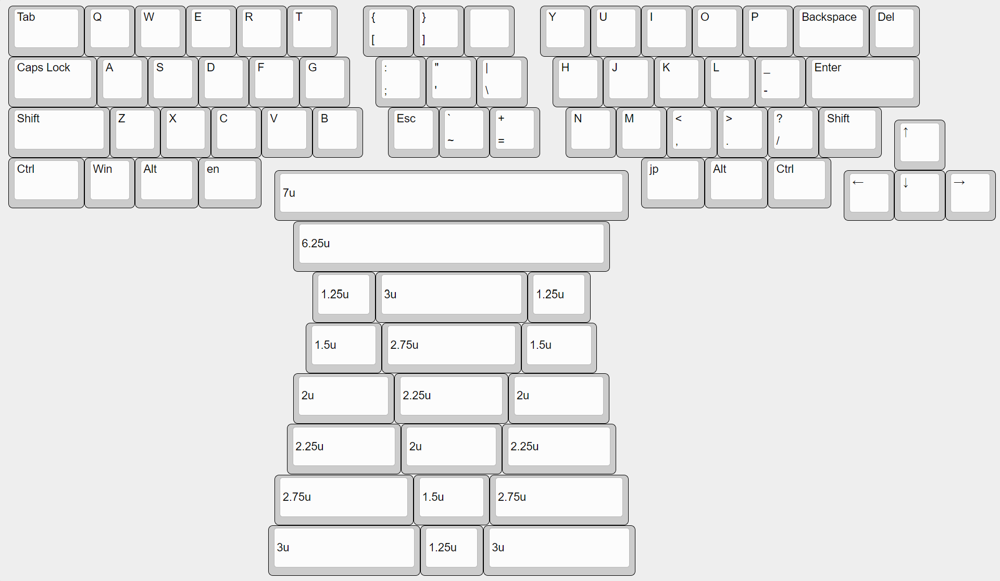

# KeeBar

A extended 40% sized keyboard

## Default Layout

Powered by RP2040 with [KMK Firmware](http://kmkfw.io/). Fully customizable.

## License

This project is licensed under the MIT License, see the [LICENSE file](LICENSE) for details.
