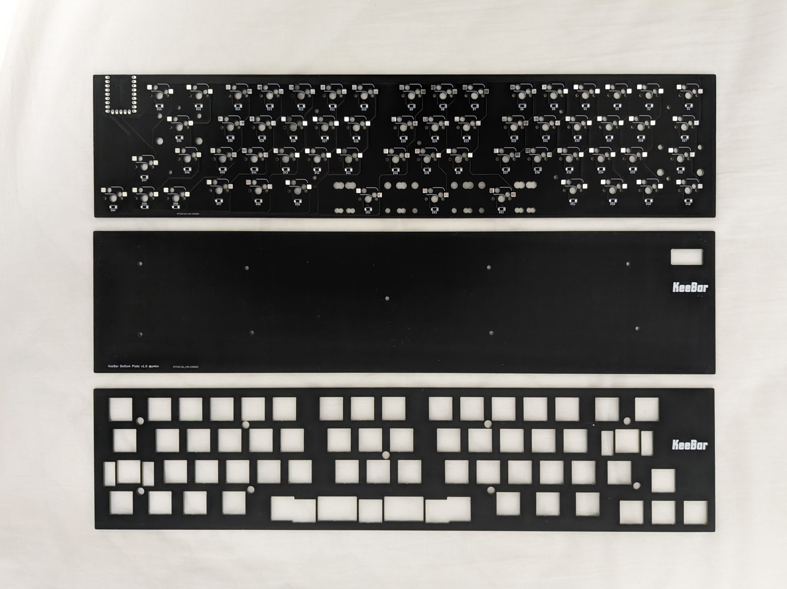
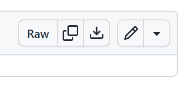
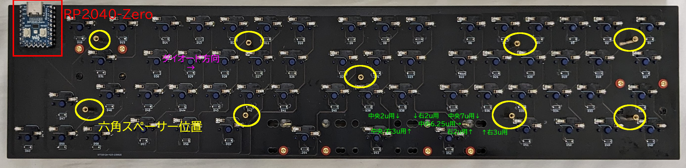
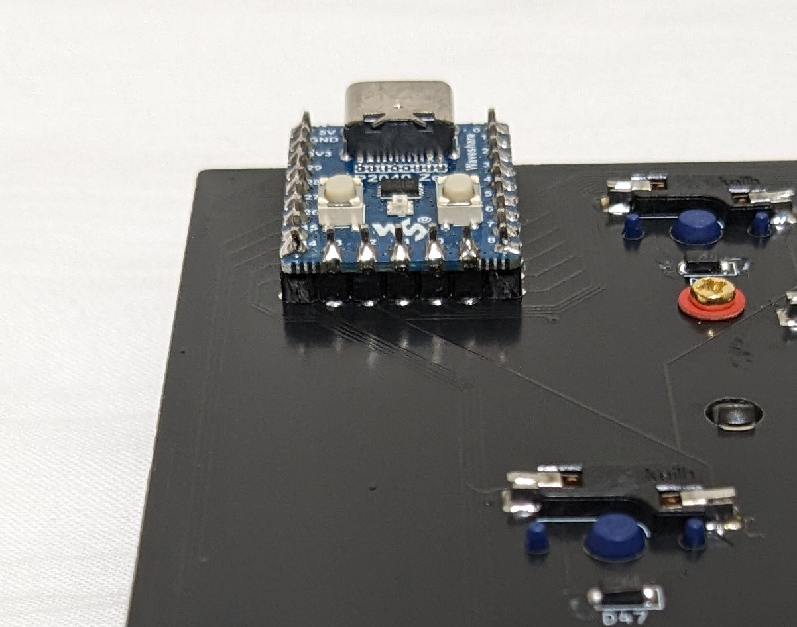

# KeeBar ビルドガイド

## 1. はじめに

本書は自作キーボードであるKeeBarのビルドガイドです。キーボードとして利用可能になるまでの手順を初心者向けに丁寧に記載したつもりですが、不明な個所などある場合は適時検索するなどして補ってください。

申し訳ないのですがKeeBar固有でない一般のご質問にはお答えできません。各自お調べください。

## 2. 準備

### 2.1 内容物確認

KeeBarは本体となる基板とキースイッチ固定用のトッププレート、底面を支えるボトムプレートのセットです。キーボードとして使用するにはその他必要な部品を別途調達いただく必要があります。

|品目|数量|
|---|---|
|KeeBar 基板|1|
|KeeBar トッププレート|1|
|KeeBar ボトムプレート|1|
|六角スペーサー|10（予備1）|
|M2ネジ|21（予備1）|

### 2.2 別途用意が必要な部品

下記部品は国内外の自作キーボード専門店や電子部品販売店などから別途調達してください。

|品目|数量|備考|
|---|---|---|
|Waveshare RP2040-Zero|1|[Waveshare製RP2040-Zero 純正品](https://www.waveshare.com/wiki/RP2040-Zero)をお勧めします。互換品もありますが動作するかはわかりません|
|ピンヘッダ（高さ2mm、ピッチ2.54mm）|23ピン分（9x2、5x1）|RP2040-Zeroにピンヘッダが同梱されていない場合は別途用意してください|
|1N4148W ダイオード (SOD123)|60|[Diodes Incorporated社製1N4148W](https://www.diodes.com/part/view/1N4148W)もしくはその互換品|
|MX互換キースイッチ|60|[Cherry MX](https://www.cherrymx.de/en/dev.html)もしくはその互換品|
|MX互換スイッチソケット|60|[Kailh PCB Socket CPG151101S11](https://www.kailhswitch.com/mechanical-keyboard-switches/box-switches/mechanical-keyboard-switches-kailh-pcb-socket.html)もしくはその互換品|
|MX互換キーキャップ|-|[Cherry MX](https://www.cherrymx.de/en/dev.html)もしくはその互換品|
|2uサイズPCBマウント型スタビライザー|2|幅の広いキーの押し下げを安定させる部品です。左ShiftキーとEnterキーに用います|
|7u or 6.25uサイズPCBマウント型スタビライザー|1|幅の広いキーの押し下げを安定させる部品です。スペースキーに用います。|
|【スペース分割する場合】2u or 3uサイズPCBマウント型スタビライザー|1～3|スペースキーは3つに分割できます。分割の仕方に応じて必要数が異なります。|

### 必要なキーキャップとサイズ

必要なキーキャップとそのサイズは下図の通りです。キーのサイズは正方形のキーの幅を「1u」と呼称します。2uであれば1uの2倍の幅のキーであることを示します。幅は0.25u刻みで様々なサイズがあります。

スペースキー部分は3つに分割が可能で、下図はそのバリエーションを示しています（図中のすべてのキーが必要なわけではありません）。

このうち、標準的なANSI/ISOレイアウト向けのキーキャップセットに含まれていないか、オプション扱いであることが多い注意すべきキーは次の通りです。オプションを購入するか、同じサイズの別の印字のキーキャップで代替してください。

|行|サイズ|初期レイアウトの対応キー名|
|---|---|---|
|R4|2u|左Shiftキー|
|R4|1.25u|右Shiftキー|
|R5|2.25u/2.75u/3u/7u|スペースキー|

### 2.3 道具

|品目|数量|備考|
|---|---|---|
|はんだごて、はんだ|1|スイッチソケットのはんだ付けに用います。はんだごては調温機能付きのものを、はんだは鉛入りのものを推奨します|
|ニッパー|1|ピンヘッダの余り部分を切断するのに使います|
|ピンセット|1|スイッチソケットのはんだ付けの際にあると便利です|
|拡大鏡|1|ダイオードの向きを確認する際にあると便利です|
|テスター|1|ダイオードの導通を確認する際にあると便利です|
|ねじ回し（プラス）|1|基板とボトムプレートを固定する際に用います|

## 3. ファームウェアの書き込み

まず初めにRP2040-Zeroの動作確認と、ファームウェアの書き込みを行います。

## 3.1 ファームウェアのダウンロード

下記からファームウェアをダウンロードしてください。

https://github.com/ymkn/KeeBar/blob/main/firmware/QMK/ymkn_KeeBar_vial.uf2

画面右上の方に下矢印のダウンロードボタンがあるので、そこを押すことでダウンロードできます。

## 3.2 RP2040-Zeroの動作確認とファームウェアの書き込み

お使いのコンピュータのUSB 2.0以上に対応したUSBコネクタと、RP2040-Zeroを接続してください。RP2040-Zeroが正常であれば、`RPI-RP2`というドライブがマウントされると思います。

もしマウントされない場合は、USBケーブルを接続した状態のままRP2040-ZeroのBOOTボタンを押しながらRESETボタンを押してください。これで`RPI-RP2`というドライブがマウントされれば問題ありません。もしこれでも何も起きない場合、RP2040-Zeroが壊れている可能性があります。。。

この`RPI-RP2`というドライブに、先ほどダウンロードしたファームウェアをコピーしてください。しばらくすると`RPI-RP2`ドライブが消えますので、これでファームウェアの書き込みは完了です。USBケーブルを抜いてください。

何らかの理由でやり直したい場合は、RP2040-ZeroのBOOTボタンを押しながらRESETボタンを押すことで、再び`RPI-RP2`というドライブをマウントすることができます。

## 4. 組み立て

### 4.1 はんだ付け

#### 4.1.1 ダイオードのはんだ付け

ダイオードは基板の裏面（ICチップ等が実装されている面）に取り付けます。コの字状のガイドが白線でキー数分印刷されていますので、そのすべてにダイオードをはんだ付けします。

ダイオードは向きが決まっています。ダイオード上の目印が印刷されている側（カソード側）が向かって右側になるようにしてください。

まず片足だけをはんだ付けした状態でテスターを使い導通確認をすると安心です。

すべてのダイオードが基板に密着しており、両端とも漏れなくはんだ付けされているか確認してください。基板から浮いていたり、はんだ付けができていないとキースイッチの動作不良の原因になります。

#### 4.1.2 スイッチソケットのはんだ付け

スイッチソケットもダイオードと同様に基板の裏面に取り付けます。L字状のガイドが白線でキー数分印刷されていますので、そのすべてにスイッチソケットをはんだ付けします。

すべてのスイッチソケットが基板に密着しており、ソケット両端とも漏れなくはんだ付けされているか確認してください。基板から浮いていたり、はんだ付けができていないとキースイッチの動作不良の原因になります。

#### 4.1.3 RP2040-Zeroのはんだ付け

RP2040-Zeroも同様に基板の裏面に取り付けます。基板左上のスルーホールにピンヘッダを差し込み、その上にRP2040-Zeroを差し込んだ形になるようにはんだ付けをしてください。ピンヘッダは足の長い方が基板表面側にに出るようにします。

> [!CAUTION]
> RP2040-Zeroの向きを間違えないようにしてください。写真の通り、裏面から見た時に、ボタンが見えるような向きである必要があります。表裏を間違えると動作しませんのでご注意ください。

基板スルーホールにピンヘッダとRP2040-Zeroを通した状態で、RP2040-Zero側を先にはんだ付けしてから、基板表面側をはんだ付けすると曲がらずにやりやすいかと思います。

最後に、基板表側に飛び出した足はニッパーで短くカットしてください。ピンヘッダの長さによっては、トッププレートと干渉してしまうためです。

### 4.2 スタビライザーの取り付け

スタビライザーは基板の表面（ロゴが印刷されている面）に取り付けます。

左ShiftキーとEnterキーに2uサイズを、スペースキーに7uもしくは6.25uサイズ（スペース分割の場合は、取り付けたいキーキャップサイズに合わせて2uや3uサイズ）のスタビライザーを取り付けます。取り付け方はスタビライザーごとに異なりますが、一般には大きい穴の方にツメを引っかけ、小さい穴の方にプッシュピンを差し込む、もしくはネジ留めを行います。

スペースキーの分割に対応する都合上、スタビライザー用の穴が密接して設けられています。実際にキースイッチとキーキャップを使って位置を合わせ、よく確認して取り付けてください。

### 4.3 ボトムプレートの取り付け

スイッチとトッププレートを取り付ける前に、基盤にボトムプレートを取り付けます。

ネジ穴が9ヶ所ありますので、基板表面からネジを差し込み、裏側から六角スペーサーを取り付けてください。

六角スペーサの上にネジ穴が合うようにボトムプレートを乗せ、ボトムプレート側からネジ留めしてください。

### 4.4 スイッチとトッププレートの取り付け

キースイッチはトッププレートを通して基板のソケットに差し込みます。すべてのキースイッチを一度に取り付けてしまうと基板に差し込むのが大変なので、まずトッププレートの四隅にキースイッチを取り付けて基板に差し込み、その後残りのスイッチを取り付けていくのがおすすめです。

### 4.5 キーキャップの取り付け

全てのスイッチにキーキャップを取り付けたら完成です！

## 5. 使用

### 5.1 動作確認

コンピュータにKeeBarを接続し、文字が入力できることを確認してください。

### 5.2 キーマップのカスタマイズ

本キーボードは[Vial](https://get.vial.today/)というキーマップ変更ツールに対応しています。Vialの詳しい使いかたはVialのドキュメントや世間の情報を参考にしてください。

何らかの理由で既定のレイアウトに戻したい場合はRP2040-Zeroをリセット（BOOTボタンを押しながらRESETボタンを押してブートモードに入った後、USBコネクタを再接続）してください。

OSのキーボード設定が日本語の時にいい感じになるキーマップファイルを下記に置いておきますのでご活用ください。

https://github.com/ymkn/KeeBar/blob/main/firmware/QMK/default_layout_jp.vil

### 5.3 漢字キー（日本語入力On/Off用のキー）について

本キーボードの初期レイアウトに漢字キーの割り当てはありません。その代わり、スペースキーの左側のキーをImeOffキーに、右側のキーをImeOnキーに割り当てています。ImeOnキーとImeOffキーはWindows 10 1903以降でMicrosoft IMEを使用している場合に利用可能です。漢字キーが必要な場合はレイアウトをカスタマイズして任意のキーに割り当ててください。

参考： [キーボード日本 \- ImeOn / ImeOff の実装 \| Microsoft Learn](https://learn.microsoft.com/ja-jp/windows-hardware/design/component-guidelines/keyboard-japan-ime)

## 6. その他

### 6.1 ブートモードの入り方

RP2040のブートモードに入るには、左上のキー（Escキー）を押しながらUSBケーブルを接続します。

もしくは、RP2040-ZeroのBOOTボタンを押しながらRESETボタンを押します。

### 6.2 ソースコード/設計データのありか

本リポジトリ内で公開しています。MITライセンスです。

https://github.com/ymkn/KeeBar
