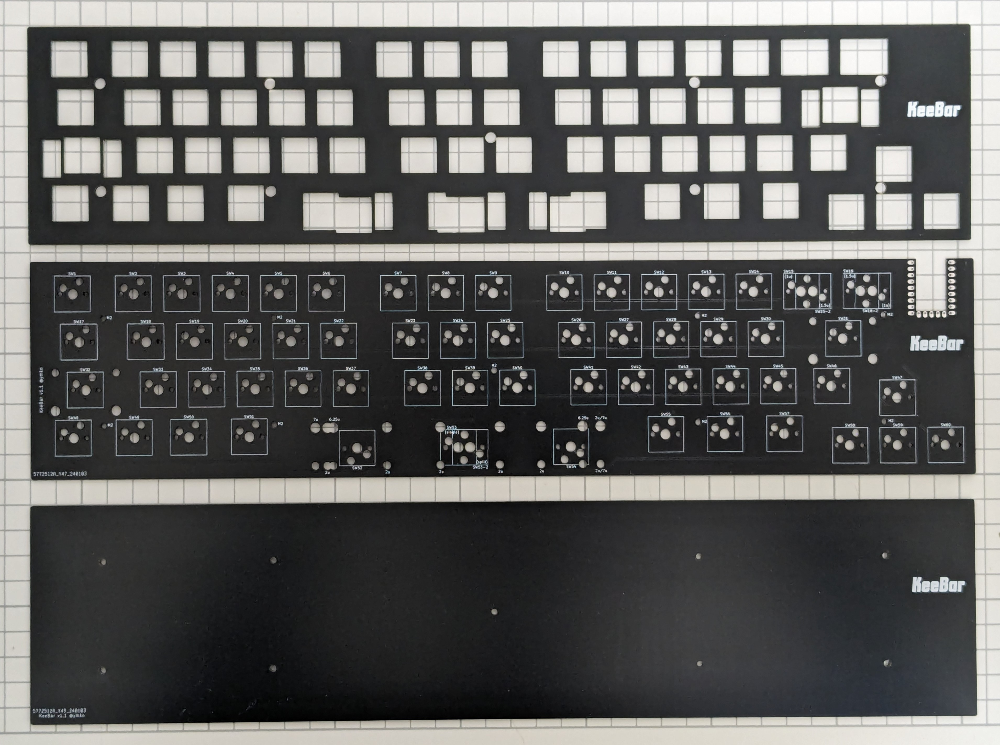
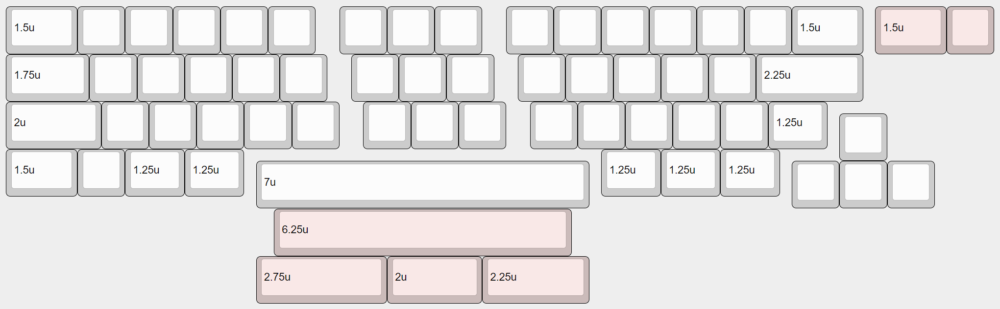
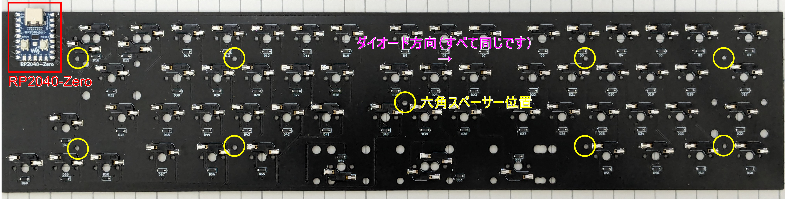
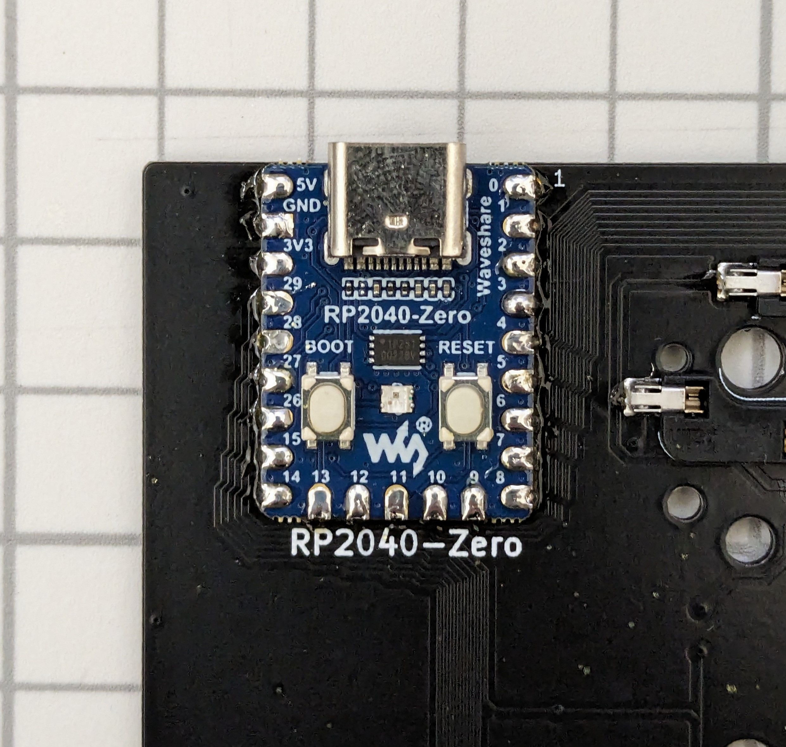
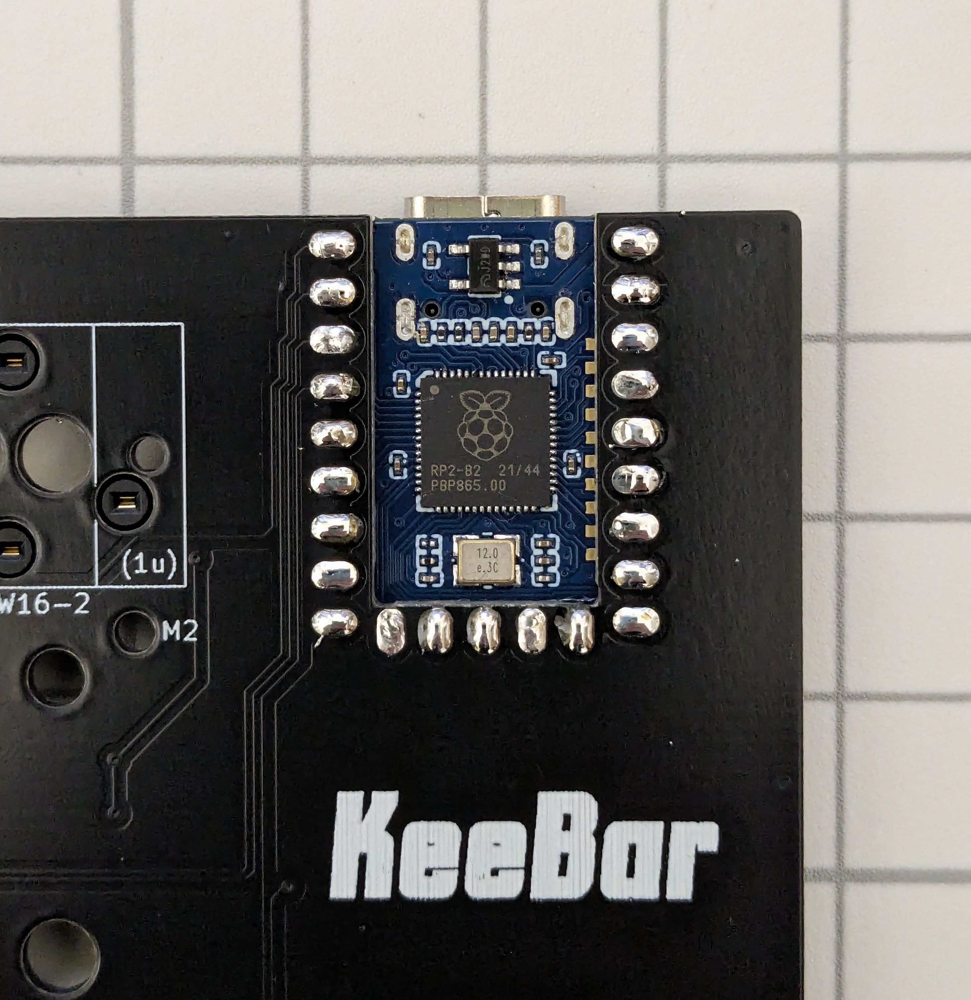
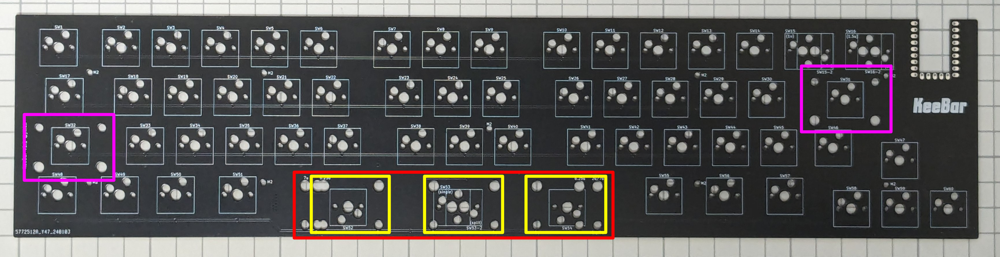

# KeeBar S ビルドガイド

## 1. はじめに

## 1.1 このドキュメントについて

本書は自作キーボードである KeeBar S（キーバー エス）のビルドガイドです。キーボードとして利用可能になるまでの手順を初心者向けに丁寧に記載したつもりですが、不明な個所などある場合は適時検索するなどして補ってください。

申し訳ないのですが KeeBar S 固有でない一般のご質問にはお答えできません。各自お調べください。

> [!NOTE]
> 2024/3/2以前に頒布していたKeeBar（無印）のビルドガイドは[こちら](buildguide.md)をご参照ください。

## 1.2 KeeBar (無印)との違い

KeeBar S は前バージョンのKeeBar（無印）のマイナーチェンジバージョンです。コンセプトやキー数、レイアウトは同じですが、下記のような変更点があります。

- スペースキーの分割バリエーションを2.75u, 2u, 2.25uの1パターンに固定
- 右上2キーのサイズを入れ替え可能に（1u, 1.5u）
- ネジ穴位置の変更
- RP2040-Zeroのはんだ付けにピンヘッダを使わず、基板に直接はんだ付けするよう変更
- 高さが低くなった（3mm程度）

## 2. 準備

### 2.1 内容物確認

 KeeBar S は本体となる基板とキースイッチ固定用のトッププレート、底面を支えるボトムプレートのセットです。キーボードとして使用するにはその他必要な部品を別途調達いただく必要があります。

|品目|数量|
|---|---|
| KeeBar S  基板|1|
| KeeBar S  トッププレート|1|
| KeeBar S  ボトムプレート|1|
|六角スペーサー 7mm|10（予備1）|
|M2ネジ 5mm|20（予備2）|

### 2.2 別途用意が必要な部品

下記部品は国内外の自作キーボード専門店や電子部品販売店などから別途調達してください。

|品目|数量|備考|
|---|---|---|
|Waveshare RP2040-Zero|1|[Waveshare製RP2040-Zero 純正品](https://www.waveshare.com/wiki/RP2040-Zero)をお勧めします。互換品もありますが動作するかはわかりません|
|1N4148W ダイオード (SOD123)|60|[Diodes Incorporated社製1N4148W](https://www.diodes.com/part/view/1N4148W)もしくはその同等品|
|MX互換スイッチソケット|63|[Kailh PCB Socket CPG151101S11](https://www.kailhswitch.com/mechanical-keyboard-switches/box-switches/mechanical-keyboard-switches-kailh-pcb-socket.html)もしくはその互換品|
|MX互換キースイッチ|58 or 60|[Cherry MX](https://www.cherrymx.de/en/dev.html)もしくはその互換品。スペースキーを分割する場合は60個必要です|
|MX互換キーキャップ|必要数|[Cherry MX](https://www.cherrymx.de/en/dev.html)もしくはその互換品|
|2uサイズPCBマウント型スタビライザー|2 or 5|幅の広いキーの押し下げを安定させる部品です。左ShiftキーとEnterキーに用います。スペースキーを分割する場合はさらに3つ、計5個必要です|
|7u or 6.25uサイズPCBマウント型スタビライザー|0 or 1|幅の広いキーの押し下げを安定させる部品です。スペースキーに用います。スペースキーを分割する場合は不要です|

### 必要なキーキャップとサイズ

必要なキーキャップとそのサイズは下図の通りです。キーのサイズは正方形のキーの幅を「1u」と呼称します。2uであれば1uの2倍の幅のキーであることを示します。幅は0.25u刻みで様々なサイズがあります。

右上の2キーは1.5uと1uの位置を入れ替え可能です。また、スペースキーは6.25への入れ替え、もしくは2.75u、2u、2.25uの3つに分割することが可能です。下図の赤色部分はそのバリエーションを示しています。

このうち、標準的なANSI/ISOレイアウト向けのキーキャップセットに含まれていないか、オプション扱いであることが多い注意すべきキーは次の通りです。

|行|サイズ|初期レイアウトの対応キー名|
|---|---|---|
|R4|2u|左Shiftキー|
|R4|1.25u|右Shiftキー|
|R5|2.25u/2.75u/7u|スペースキー|

キーの印字はただの飾りですので、同じサイズのキーキャップであれば異なる印字でも代替可能です。

### 2.3 道具

以下の道具が必要です。

|品目|数量|備考|
|---|---|---|
|はんだごて、はんだ|1|ダイオードやスイッチソケットのはんだ付けに用います|
|ピンセット|1|はんだ付けの際にあると便利です|
|ねじ回し（プラス）|1|基板とボトムプレート（もしくはケース）を固定する際に用います|

以下の道具は、あると便利なものです。

|品目|数量|備考|
|---|---|---|
|拡大鏡|1|ダイオードの向きを確認する際にあると便利です|
|テスター|1|ダイオードの導通を確認する際にあると便利です|

## 3. ファームウェアの書き込み

まず初めにRP2040-Zeroの動作確認と、ファームウェアの書き込みを行います。

## 3.1 ファームウェアのダウンロード

下記からファームウェアをダウンロードしてください。

https://github.com/ymkn/KeeBar/releases/download/v1.1/ymkn_KeeBar_vial.uf2

## 3.2 RP2040-Zeroの動作確認とファームウェアの書き込み

お使いのコンピュータのUSB 2.0以上に対応したUSBコネクタと、RP2040-Zeroを接続してください。RP2040-Zeroが正常であれば、`RPI-RP2`というドライブがマウントされると思います。

もしマウントされない場合は、USBケーブルを接続した状態のままRP2040-ZeroのBOOTボタンを押しながらRESETボタンを押してください。これで`RPI-RP2`というドライブがマウントされれば問題ありません。もしこれでも何も起きない場合、RP2040-Zeroが壊れている可能性があります。。。

この`RPI-RP2`というドライブに、先ほどダウンロードしたファームウェアをコピーしてください。しばらくすると`RPI-RP2`ドライブが消えますので、これでファームウェアの書き込みは完了です。USBケーブルを抜いてください。

> [!NOTE]
> 何らかの理由でやり直したい場合は、RP2040-ZeroのBOOTボタンを押しながらRESETボタンを押すことで、再び`RPI-RP2`というドライブをマウントすることができます。

## 4. 組み立て

### 4.1 はんだ付け

はんだ付けが必要な部品はダイオード、スイッチソケット、RP2040-Zeroです。下記写真の通り、すべて基板裏面（ロゴのついていない方）にはんだ付けしますので間違えないように注意してください。

#### 4.1.1 ダイオードのはんだ付け

「コ」の字状のガイドが白線でキー数分印刷されていますので、そのすべてにダイオードをはんだ付けします。

> [!WARNING]
> ダイオードは向きが決まっています。ダイオード上の目印が印刷されている側（カソード側）が向かって右側になるようにしてください。

> [!TIP]
> まず片足だけをはんだ付けした状態でテスター等を使い導通確認をすると、向きが間違っていても直しやすく安心です。

すべてのダイオードが基板に密着しており、両端とも漏れなくはんだ付けされているか確認してください。基板から浮いていたり、はんだ付けができていないとキースイッチの動作不良の原因になります。

#### 4.1.2 スイッチソケットのはんだ付け

L字状のガイドが白線でキー数＋3個分印刷されていますので、そのすべてにスイッチソケットをはんだ付けします。

すべてのスイッチソケットが基板に密着しており、ソケット両端とも漏れなくはんだ付けされているか確認してください。基板から浮いていたり、はんだ付けができていないとキースイッチの動作不良の原因になります。

#### 4.1.3 RP2040-Zeroのはんだ付け

基板左上の切り欠きを覆うようにRP2040-Zeroを直接置き、はんだ付けをしてください。RP2040-Zeroのパッケージにピンヘッダが同梱されていたかもしれませんが、KeeBar S ではピンヘッダを使いません。

> [!TIP]
> ピンヘッダは使わない、と書きましたが、位置合わせのためにピンヘッダで基板とRP2040-Zero仮止めするとはんだ付けしやすく便利です。ただし、何度も書きますが、誤ってピンヘッダをはんだ付けしないように注意してください。

> [!WARNING]
> RP2040-Zeroの向きを間違えないようにしてください。写真の通り、裏面から見た時に、BOOT/RESETボタンが見えるような向きである必要があります。表裏を間違えると動作しませんのでご注意ください。

はんだ付けが終わったら基板をひっくり返し、表面側にも十分にはんだが流れ込んでいることを確認してください。不足していると感じたら、表面側からもはんだを足してください。

### 4.2 スタビライザーの取り付け

スタビライザーは基板の表面（ロゴが印刷されている面）に取り付けます。取り付け方はスタビライザーごとに異なりますが、一般には大きい穴の方にツメを引っかけ、小さい穴の方にプッシュピンを差し込む、もしくはネジ留めを行います。

> [!IMPORTANT]
> スペースキー部分は分割レイアウト用にスタビライザー用の穴が複数開いていますので、基板表面の記載（7u、6.25u、2u等表記）を確認して適切な穴に取り付けてください。もし間違ってしまっても、スタビライザーは容易に取り外しできます。

#### スペースキーを分割しない場合

左ShiftキーとEnterキー部分（紫色）に2uサイズを、スペースキー部分（赤色）に7uもしくは6.25uサイズのスタビライザーを取り付けます。

#### スペースキーを分割する場合

左ShiftキーとEnterキー部分（紫色）およびスペースキー部分（黄色）に2uサイズのスタビライザーを取り付けます。

### 4.3 スイッチとトッププレートの取り付け

キースイッチはトッププレートを通して基板のソケットに差し込みます。すべてのキースイッチを一度に取り付けてしまうと基板に差し込むのが大変なので、まずトッププレートの四隅にキースイッチを取り付けて基板に差し込み、その後残りのスイッチを取り付けていくのがおすすめです。

### 4.4 スペーサーの取り付け

写真の「六角スペーサー位置」に示した穴すべてにスペーサーを取り付けます。基板表面側からネジを差し込んで指で押さえながら、裏側から六角スペーサーを回して取り付けてください。最後にねじ回しを使って軽く締めてください。

### 4.5 キーキャップの取り付け

全てのスイッチにお好みのキーキャップを取り付けてください。

### 4.6 ボトムプレート/ケースの取り付け

ボトムプレートか、ケースを取り付けて完成です。

#### ケースを使う場合

ケースに取り付ける場合はボトムプレートを使用しません。まず基板をケースに設置してからケースごと裏返し、裏面のネジ穴すべてにネジ留めを行ってください。

#### ボトムプレートを使う場合

基板を裏返した状態で、六角スペーサの上にネジ穴が合うようにボトムプレートを乗せ、ボトムプレート側からネジ留めしてください。

## 5. 使用

### 5.1 動作確認

コンピュータに KeeBar S を接続し、文字が入力できることを確認してください。

### 5.2 キーマップのカスタマイズ

本キーボードは[Vial](https://get.vial.today/)というキーマップ変更ツールに対応しています。Vialの詳しい使いかたはVialのドキュメントや世間の情報を参考にしてください。

既定では、OSのキーボード設定が英語の場合のレイアウト設定になっています。OSのキーボード設定が日本語の場合は（日本語Windowsを使っている人はほとんどこちらです）、下記キーマップファイルをVialで読み込むといい感じになりますのでご活用ください。

https://github.com/ymkn/KeeBar/releases/download/v1.1/default_layout_jp.vil

> [!NOTE]
> キーマップファイルは、アプリ版のVialでのみ読み込むことができます。Web版には読み込み機能がありませんのでご注意ください。

> [!TIP]
> 何らかの理由で既定のレイアウトに戻したい場合は、本書末尾記載の「ブートモードの入り方」に従いブートモードに入った後、再度USBケーブルを抜き差ししてください（この時はどのキーも押す必要はありません）。

### 5.3 漢字キー（日本語入力On/Off用のキー）について

本キーボードの初期レイアウトに漢字キーの割り当てはありません。その代わり、スペースキーの左側のキーをImeOffキーに、右側のキーをImeOnキーに割り当てています。ImeOnキーとImeOffキーはWindows 10 1903以降でMicrosoft IMEを使用している場合に利用可能です。漢字キーが必要な場合はレイアウトをカスタマイズして任意のキーに割り当ててください。

参考： [キーボード日本 \- ImeOn / ImeOff の実装 \| Microsoft Learn](https://learn.microsoft.com/ja-jp/windows-hardware/design/component-guidelines/keyboard-japan-ime)

### 5.4 ケースデータについて

KeeBar S 専用ケースの3Dプリント用モデルデータを公開しています。お持ちの3Dプリンタや、お好みの3Dプリントサービスで印刷いただけます。

- https://github.com/ymkn/KeeBar/releases/download/v1.1/KeeBar1.1-Case.stl
- https://github.com/ymkn/KeeBar/releases/download/v1.1/KeeBar1.1-Case.step

> [!CAUTION]
> CNC Machiningによる削り出し造形は、設計上考慮されていません。

## 6. その他

### 6.1 ブートモードの入り方

RP2040のブートモードに入るには、左上のキー（Tabキー）を押しながらUSBケーブルを接続します。

もしくは、RP2040-ZeroのBOOTボタンを押しながらRESETボタンを押します。

### 6.2 ソースコード/設計データのありか

本リポジトリ内で公開しています。MITライセンスです。

https://github.com/ymkn/KeeBar
